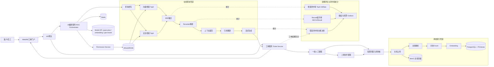
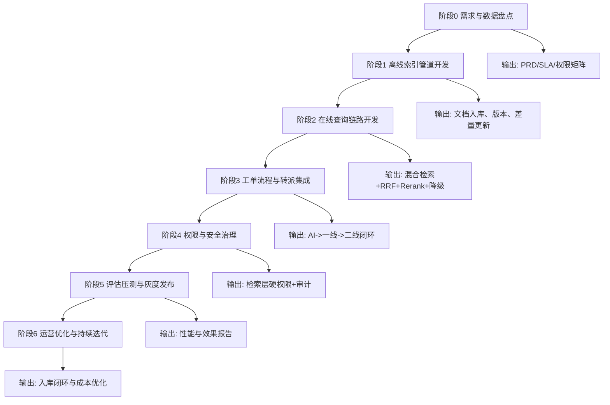
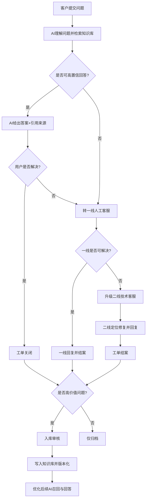
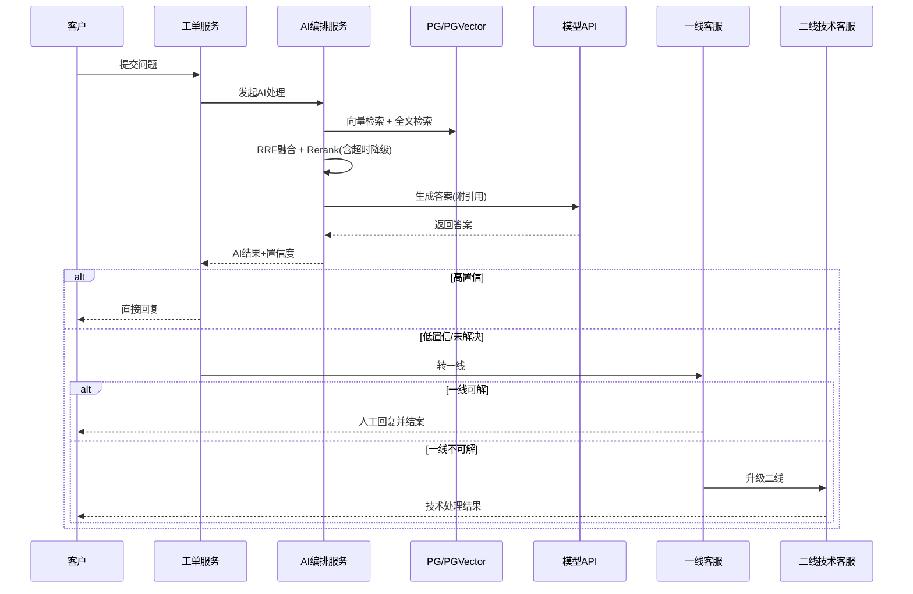
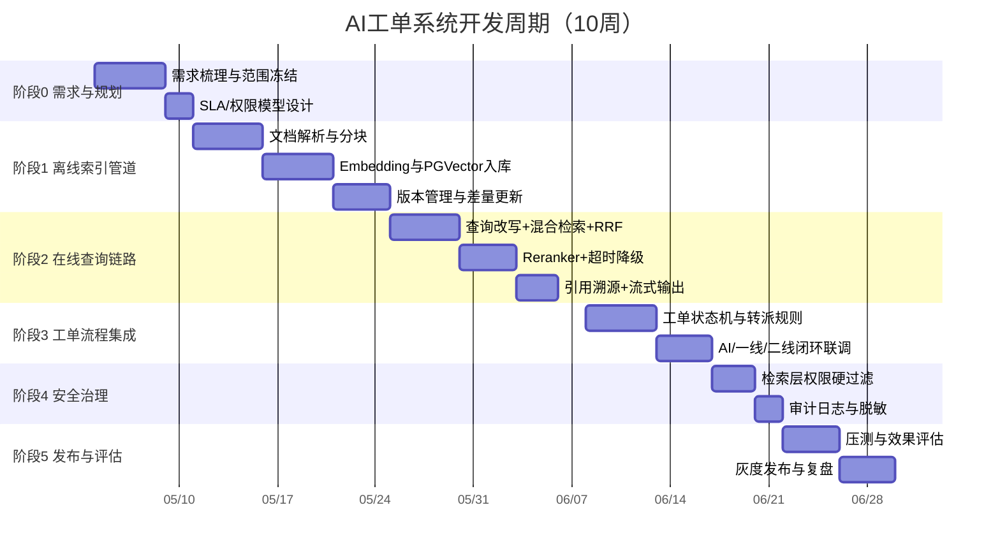
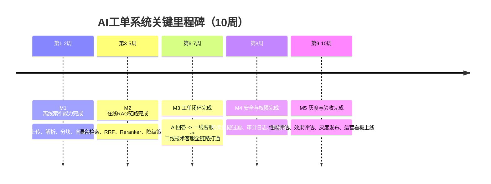

# AI工单系统技术选型与流程图

## 1. 技术选型

## 1.1 核心技术栈

| 模块 | 技术选型 | 选型理由 |
|---|---|---|
| 后端框架 | Spring Boot 3.5 + Java 21 | 企业级成熟，生态完善，便于服务治理与长期维护 |
| AI编排 | Spring AI 1.1（自定义检索链路） | 保留框架集成便利，同时支持混合检索、精排、降级、溯源的自定义能力 |
| 生成模型 | qwen-plus | 中文问答与指令跟随能力好，适合企业客服场景 |
| 向量模型 | text-embedding-v3 | 语义检索质量稳定，适配RAG链路 |
| 重排模型 | gte-rerank | 精排效果好，可提升最终答案相关性 |
| 主数据库 | PostgreSQL | 稳定可靠，事务与结构化数据管理能力强 |
| 向量检索 | PGVector（HNSW） | 与PostgreSQL一体化，降低运维复杂度 |
| 全文检索 | PostgreSQL GIN + tsvector | 补足精确词、术语、条款号检索能力 |
| 缓存 | Redis | 会话缓存、热点问答缓存、限流与临时状态存储 |
| 文档存储 | MinIO | 文档与附件统一存储，支持版本化与对象管理 |
| 消息异步 | RabbitMQ/Kafka（可选） | 处理索引构建、回流入库、评估任务等异步流程 |
| 可观测性 | Prometheus + Grafana + Loki | 指标、日志、告警全链路监控 |

## 1.2 关键技术策略

- 不使用默认单路问答链路，采用“可控分步式检索编排”
- 检索采用“向量检索 + 全文检索 + RRF 融合”
- 权限控制在检索层强制过滤，不依赖 Prompt
- Reranker 超时自动降级，保障稳定性与响应时延

---

## 2. 技术框架图

---

## 3. 开发流程图（项目实施）

---

## 4. 业务逻辑图（工单闭环）

---

## 5. 运行时处理流程（接口视角）

---

## 6. 建议的里程碑与验收指标

- M1（第2周）：离线索引管道可用，文档可入库可检索
- M2（第5周）：在线RAG链路可用，支持混合检索与降级
- M3（第7周）：工单转派闭环可用（AI/一线/二线）
- M4（第10周）：灰度发布，完成评估与运营看板

建议核心指标：

- 自动解决率 >= 35%
- Top5 检索命中率 >= 85%
- 首次响应 P95 <= 10s
- 转人工准确率 >= 90%
- 越权召回 = 0
- 高价值问题入库率 >= 80%

---

## 7. 开发周期图（甘特图）

---

## 8. 里程碑图（Milestone Timeline）

