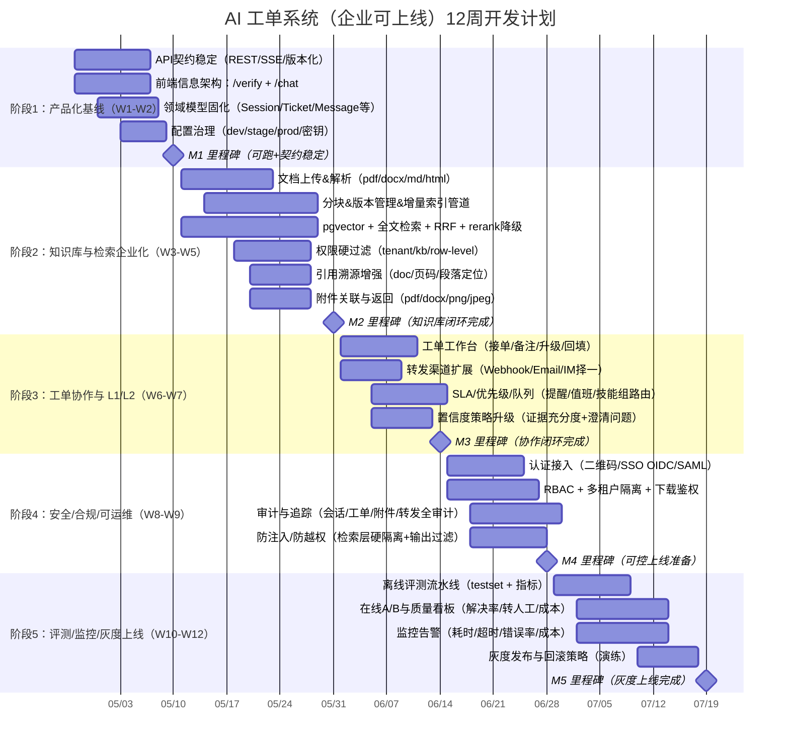
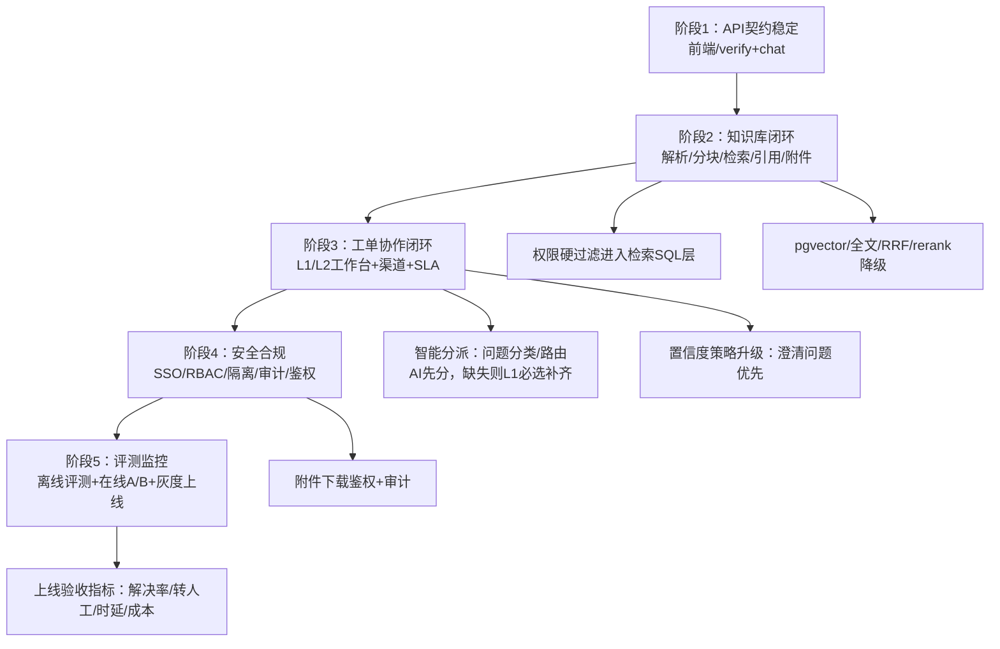

## AI 工单系统开发计划图（关键节点 & 里程碑）

> 说明：这是面向“企业可上线版本”的路线图，按 12 周规划。可根据人力（前端/后端/算法/运维）并行调整。

### 里程碑总览
- **M1（第 2 周末）**：新前端（`/verify` + `/chat`）+ API 契约稳定 + dev/stage/prod 配置规范
- **M2（第 5 周末）**：知识库全链路（上传→解析→分块→入库→检索→引用/附件返回）+ 权限硬过滤
- **M3（第 7 周末）**：L1/L2 工作台 + 多渠道转发 + SLA/队列/升级闭环
- **M4（第 9 周末）**：安全与审计达标（SSO/RBAC/隔离/审计/下载鉴权）+ 可控上线准备
- **M5（第 12 周末）**：评测与监控齐全 + 灰度上线完成（可回滚）

### 开发计划甘特图（12 周）

### 关键节点依赖关系（你可以用来做评审）

